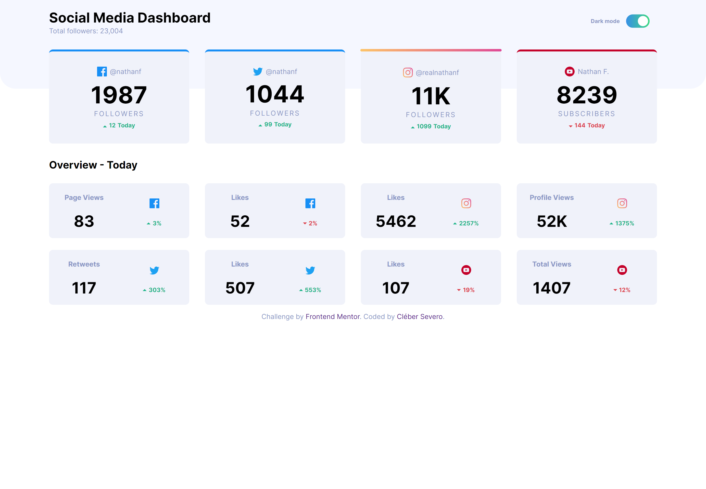

# Dark-mode

## Hello world \o/
Hello! I would like to thank you for having a look on my project, it is a goal I aways wanted to reach, understand and implemment on my projects, it has challenged my copre skills but as aways: even by all the struggle and time spent...it was all worth it at the end of de day :) 

## The project
It is the implemmentation of a dark-mode for a social media status web site, it is a HTML|CSS and JavaScript project with responsive layout.  

This project is a front-end challenge made by **FontEnd Mentor**

## How does it work ?
There is a single button that at being pressed changes the whole apperance of the page, it toggles between dark and light mode. The user is capable of having a hover and active effect when interacting with the cards.

## Project design

**Dark page** 

 

 **Light page** 
 

**Responsive** 
  
  
